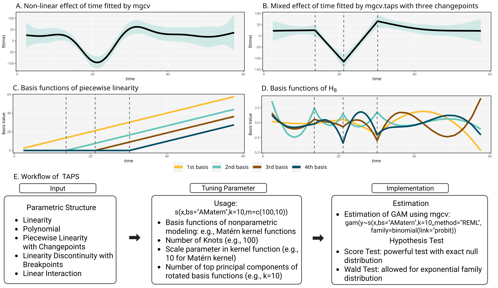

```{r setup, include=FALSE}
knitr::opts_chunk$set(echo=TRUE)
```

# mgcv.taps

`mgcv.taps` is an extension of the `mgcv` package that implements the **Test for Arbitrary Parametric Structure (TAPS)**. When considering nonparametric approach like a generalized additive model (GAM), a common starting point is to evaluate whether a simpler parametric model, such as a generalized linear model (GLM), can adequately capture the data’s variation. TAPS directly addresses this question by providing inference tools to assess whether a parametric structure is sufficient to describe the target function within a GAM framework.



## Installation

You can install the development version of `mgcv.taps` from GitHub:

```r
devtools::install_github("harryyiheyang/mgcv.taps")
```

## Overview

This package supports smooth function construction, estimation, and hypothesis testing under arbitrary parametric constraints, by extending the `mgcv` smoothing interface.

Two types of smoothers are currently implemented:

### 1. Univariate Structured Smooth (`bs="AMatern"`)

This smoother models a function as:

```
f(x) = A(x)%*%alpha + B(x)%*%beta
```

- `A(x)` is a user-defined basis matrix representing a structured parametric component (e.g., `cbind(1,x,x^2)` for quadratic functions, or `cbind(1,x,pmax(0,x-nu))` for piecewise structures).
- `B(x)` is a set of smooth basis functions adaptively constructed using a Matern kernel and constrained to be orthogonal to `A(x)`:

```
t(A)%*%B=0
```
The statistical method used to enforce `t(A) %*% B = 0` share insights with the boundary condition applied in thin plate splines ([Wood, 2003](https://academic.oup.com/jrsssb/article/65/1/95/7110632)).


### 2. Bivariate Structured Smooth (`bs="A2Matern"`)

This extension handles bivariate smooths with similar structure:

```
f(x1,x2) = A(x1,x2)%*%alpha + B(x1,x2)%*%beta
```

- `A(x1,x2)` can represent structured interaction effects (e.g., `cbind(1,x1,x2,x1*x2)`).
- `B(x1,x2)` is constructed using Matern kernels and is orthogonal to `A(x1,x2)`.

Additional smoother types may be supported in future versions.

## Estimation

Estimation is performed using `mgcv::gam()`. The `xt` argument should be a list:

- `getA`: a user-specified function returning the parametric basis matrix `A`.
- `para`: optional parameters used in constructing `A`.

### Univariate Example

```
gam(y~s(x,bs="AMatern",k=10,xt=list(getA=function(x,para) cbind(1,x))),
        family=c("gaussian","binary",...),method=c("REML","GCV.Cp",...))
```

### Bivariate Example

```
gam(y~s(x1,x2,bs="A2Matern",k=10,xt=list(getA=function(x1,x2,para) cbind(1,x1,x2,x1*x2)))),
       family=c("gaussian","binary",...),method=c("REML","GCV.Cp",...))
```

### Quantile Example

When the response follows the Gaussian distribution, quantile GAM (`qgam`) can also be incorporated with mgcv.taps, whose usage is slight different from `gam`:

```
qgam(y~s(x,bs="AMatern",k=10,xt=list(getA=function(x,para) cbind(1,x))),qu=0.5,data=data)
```

```
qgam(y~s(x1,x2,bs="A2Matern",k=10,xt=list(getA=function(x1,x2,para) cbind(1,x1,x2,x1*x2))),qu=0.5,data=data)

```

## Hypothesis Testing

The package provides a wrapper for Wald tests on specific components of the model using `taps_wald_test`, which actually wraps an unobserved function `mgcv::testStat` ([Wood, 2013](https://academic.oup.com/biomet/article/100/1/221/192816)):

```
taps_wald_test(fit,test.component=1)
```

Alternatively, one can also perform a score test variance component using `taps_score_test` ([Zhang and Lin, 2003](https://doi.org/10.1093/biostatistics/4.1.57)).


```
taps_score_test(fit,test.component=1)
```

Both can be used to formally test the parametric structure encoded in `A`. In these two test functions, `test.component` refers to the index of smooth term to be tested.  

For hypothesis testing, `taps_wald_test` also supports all outcome families. However, `taps_score_test` is currently limited to exponential family distributions.

## Example

This example demonstrates how to use the `mgcv.taps` package to study causal effects using the **Huai River dataset**, as described in [Ebenstein et al. (2017)](https://doi.org/10.1073/pnas.1616784114). The dataset includes observations from China's Disease Surveillance Points (DSPs) located near the Huai River boundary. We examine whether the policy-induced discontinuity at the Huai River affects PM10 concentrations, using structured smooth terms.

```{r,message=F,warning=F}
library(mgcv)
library(mgcv.taps)
library(ggplot2)
library(mgcViz)
library(qgam)
library(dplyr)
data("Huai_River")
head(Huai_River)
ggplot(Huai_River, aes(x = dist_huai, y = pm10)) +
  geom_point(color = "black", size = 3, fill="#60c5ba",shape=21) +
  labs(
    title = "PM10 Concentration vs. Distance from Huai River",
    x = "Distance from Huai River",
    y = "PM10 Concentration"
  ) +
  theme(
    panel.border = element_rect(color = "black", fill = NA, size = 1),
    panel.background = element_rect(fill = "#f4f4f4"),
    plot.background = element_rect(fill = "#f4f4f4")
  )
```

We first fit a standard GAM to estimate the non-linear effect of distance from the Huai River on PM10 concentration.
```{r,message=F,warning=F}
fit0 = gam(pm10 ~ s(dist_huai, bs = "gp"), data = Huai_River, method = "REML")
b0 = getViz(fit0)
plot(sm(b0, 1)) +
l_ciPoly(mul = 5, fill = "#60c5ba", alpha = 0.25) +
l_rug(mapping = aes(x = x), alpha = 0.25, color = "#60c5ba") +
l_fitLine(colour = "black", size = 2) +
l_points()+
theme_get() +
xlab("Distance from Huai River (dist_huai)") + ylab("f(dist_huai)") +
ggtitle("Non-linear effect of Distance from Huai River fitted by mgcv") +
theme(panel.border = element_rect(colour = "black", fill = NA, size = 1),
      panel.background = element_rect(fill = "#f4f4f4"))
```

We then test whether a discontinuity at `dist_huai = 0` is sufficient by fitting a mixed-linear term using `linearity_discontinuity()`.
```{r}
fit1 = gam(pm10 ~ s(dist_huai, bs = "AMatern", xt = list(getA = linearity_discontinuity, para = 0)),
         data = Huai_River, method = "REML")
b1 = getViz(fit1)
plot(sm(b1, 1)) +
l_ciPoly(mul = 5, fill = "#60c5ba", alpha = 0.25) +
l_rug(mapping = aes(x = x), alpha = 0.25, color = "#60c5ba") +
l_fitLine(colour = "black", size = 2) +
l_points()+
theme_get() +
xlab("Distance from Huai River (dist_huai)") + ylab("f(dist_huai)") +
ggtitle("Mixed-linear effect of Distance from Huai River fitted by mgcv.taps") +
theme(panel.border = element_rect(colour = "black", fill = NA, size = 1),
      panel.background = element_rect(fill = "#f4f4f4"))
```

We conduct a score test and Wald test to assess whether a more flexible model is necessary.
```{r}
taps_score_test(fit1)[, 1:4]
taps_wald_test(fit1)
```
The results support the null hypothesis that the linearity discontinuity at `dist_huai = 0` sufficiently captures the variation.

We then fit a model using the parametric form `A %*% alpha` to estimate the causal effect directly.
```{r}
X=linearity_discontinuity(Huai_River$dist_huai, para = 0)
fit2 = gam(pm10 ~ X, data = Huai_River)
summary(fit2)
```
The estimated jump at `dist_huai = 0` is 32.10. This estimate can also be extracted from `fit1`:
```{r}
data.frame(Estimate=fit1$coefficients,SE=summary(fit1)$se)%>%mutate(P=pchisq(Estimate^2/SE^2,1,lower.tail=F))
```
Here, the second coefficient of `s(dist_huai)` corresponds to the jump. Under the mixed-effect structure, the estimated jump is 31.08.

We also observe a few outliers, including one PM10 value > 300 near the cutoff. To improve robustness, we apply median regression using `qgam`.
```{r,message=F,warning=F}
fit3 = qgam(pm10 ~ s(dist_huai, bs = "AMatern", xt = list(getA = linearity_discontinuity, para = 0)),
          data = Huai_River, qu = 0.5)
b3 = getViz(fit3)
plot(sm(b3, 1)) +
l_ciPoly(mul = 5, fill = "#60c5ba", alpha = 0.25) +
l_rug(mapping = aes(x = x), alpha = 0.25, color = "#60c5ba") +
l_fitLine(colour = "black", size = 2) +
l_points()+
theme_get() +
xlab("Distance from Huai River (dist_huai)") + ylab("f(dist_huai)") +
ggtitle("Mixed-linear effect of Distance from Huai River fitted by mgcv.taps and qgam") +
theme(panel.border = element_rect(colour = "black", fill = NA, size = 1),
      panel.background = element_rect(fill = "#f4f4f4"))
```

The estimated causal effect (jump at the cutoff) from the median regression is 28.48:
```{r}
data.frame(Estimate=fit3$coefficients,SE=summary(fit3)$se)%>%mutate(P=pchisq(Estimate^2/SE^2,1,lower.tail=F))
```
This is evidence that median GAM can be used to make the fit more robust. Currently, score tests are only supported for exponential family models. Therefore, we use the Wald test for inference:

```{r}
taps_wald_test(fit3)
```
The results continue to support the linearity discontinuity structure.


## License

MIT

## Maintainer

Yihe Yang
Email: yxy1234@case.edu
